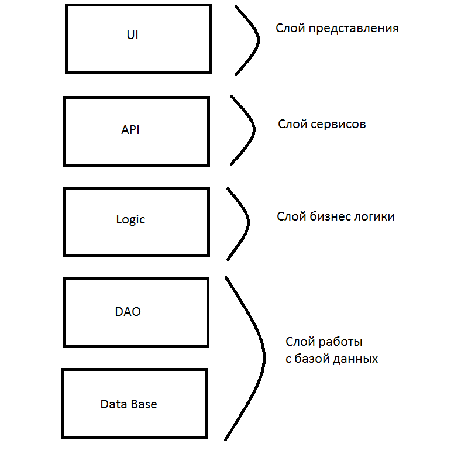

## Проектирование архитиктуры

1) Тип приложения: веб-приложение.
2) Стратегия развёртывания: запуск приложения из Интернета или общего сетевого ресурса.
3) Выбранные технологии:
   * Angular - выбран для разработки фронтенда. Причины: реактивное программирование, тайпскрипт(лёгкий в понимании) + стильно, модно, молодёжно)
   * Java(Spring) - выбран для разработки бэкенда. Основное преемущество спринга - возможность разработки 
   приложения как набора слабосвязанных компонентов. Чем меньше компоненты приложения знают друг о друге, тем проще разрабатывать новый и поддерживать существующий функционал приложения.
   Также множество полезных проектов (типа spring data) + idea(удобная штука).
   * MySQL - выбран для хранения данных. При выборе бд отталкивались от знаний команды (выбирали между PostgreSQL и MySQL).
4) Показатели качества:
   * Стилевая согласованность сайта.
   * Доступность контента.
   * Орфографическая грамотность + стилистическая корректность.
   * Удобство навигации по сайту.
   * Надёжность функционирования (проверки, подсказки).
   * Грамотное использование ресурсов сервера.
5) Пути реализации сквозной функциональности:
   * Валидация - проверка вводимых данных.
   * Управление исключениями - перехват исключений на разных слоях приложения. Реализованы 'свои' исключения, для подробной информации об ошибке.
   * Аутентификация - реалищована система аутентификации.
   * Управление конфигурацией - данные пользователя(сервиса) будут сохряняться для последующего использования.
   * Безопастность - использование spring security.
6) Структурная схема приложения:

 
 
 ## Анализ архитектуры
 1) Анализ архитектуры: Пользователь получает доступ к веб-приложению посредствам UI, далее запросы передаются на API. Здесь контроллер распределяет запросы и отправляет на нужный сервис, затем реализуется бизнес логика посредствам обращения к базе данных через dao.
 2) Текущая архитектура совпадает с запланированной(т.к. реализовано через паттерны)
 
 3) Сгенерированная диаграмма классов:
 
 
